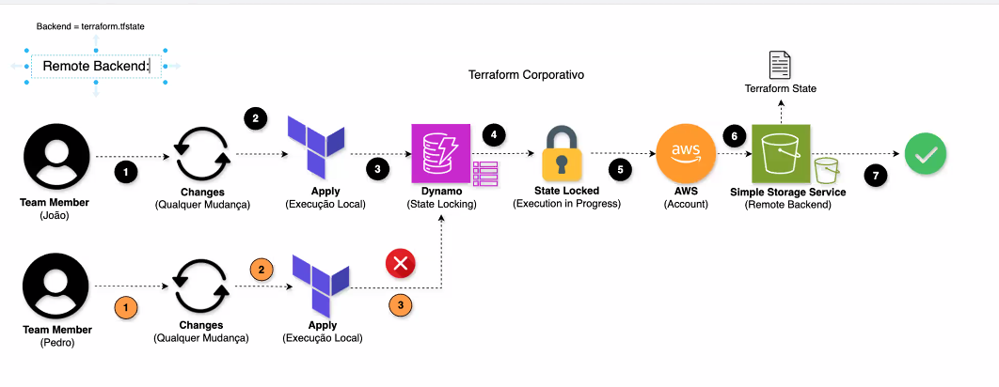

# AWS DEVOPS

Curso de aws devops, mentoria do Kenerry Serain

# Aula 1

- Colocar as credentials criadas em IAM como adm `code ~/.aws/credentials`

  `export AWS_PROFILE={usuario}`
  `aws sts get-caller-identity`

### Ioc

- Terraform

- terraform init
- terraform validate
- terraform fmt
- terraform apply

**Nunca comitar o terraform.tfstate**
Remote backend - é o ato de salvar o terraform tf.state remotamente em algum lugar resolve o problema de duplicidade do terraform state.
State locking - é o ato de bloquear execução simultânea de uma mesma stack do terraform.

Para fazer o rollback basta baixar a versao no 

Com isso faz o enfileramento de requisições

https://developer.hashicorp.com/terraform/language/backend/remote
