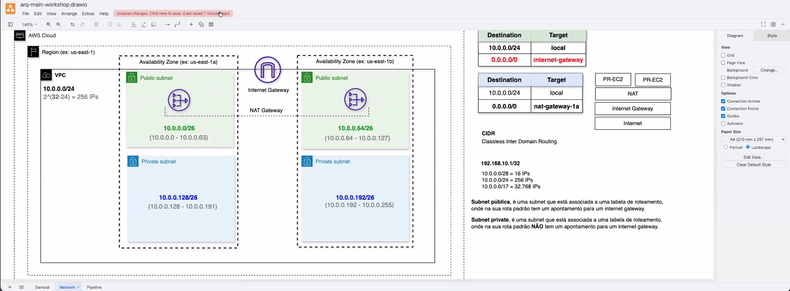
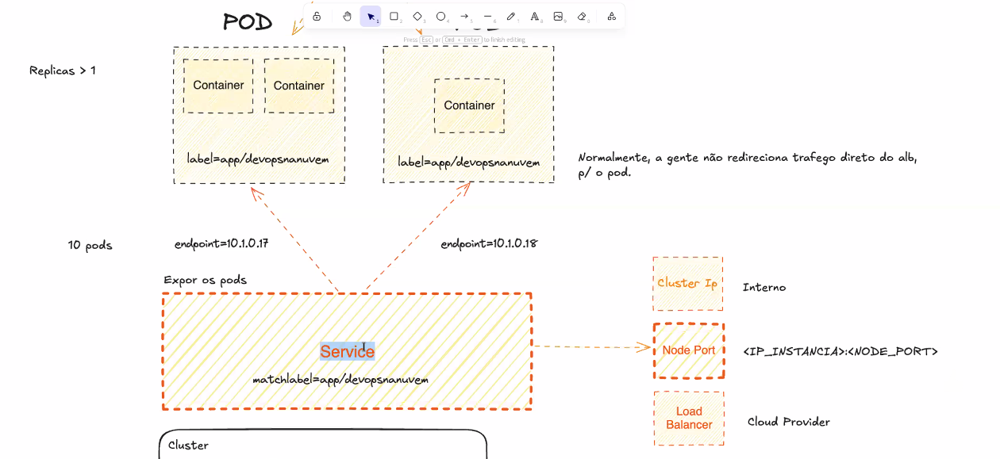
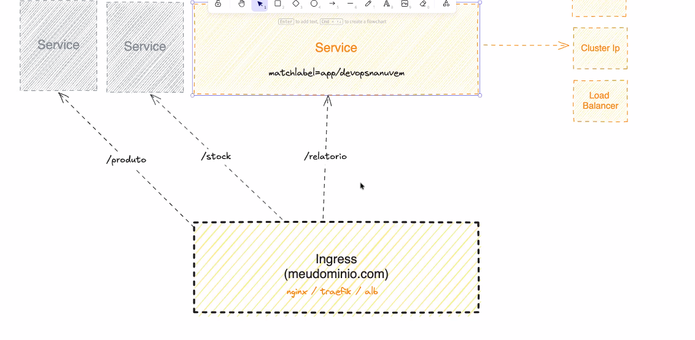

# AWS DEVOPS

Curso de aws devops, mentoria do Kenerry Serain

# Aula 1

- Colocar as credentials criadas em IAM como adm `code ~/.aws/credentials`

  `export AWS_PROFILE={usuario}`
  `aws sts get-caller-identity`

### Ioc

- Terraform

- terraform init
- terraform validate
- terraform fmt
- terraform apply

**Nunca comitar o terraform.tfstate no github**

Remote backend - é o ato de salvar o terraform tf.state remotamente em algum lugar resolve o problema de duplicidade do terraform state.

State locking - é o ato de bloquear execução simultânea de uma mesma stack do terraform.

Para fazer o rollback basta baixar a versao no bucket s3 ou no dynamo , onde estiver setado no backend

Com isso faz o enfileramento de requisições

https://developer.hashicorp.com/terraform/language/backend/remote

# Redes

Enviar o arquivo .pem da maquina para o servidor
`scp -i "workshop-march-key-pair-virg.pem" workshop-march-key-pair-virg.pem ec2-user@18.204.203.129:/home/ec2-user`

CIDR - classes inter domain roting
Sample: 10.0.0.0/24 - 256 IPS
Formula: 2 ^ (32 - 24) = 256

# K8s

Um cluster Kubernetes consiste em um conjunto de servidores de processamento, chamados nós, que executam aplicações conteinerizadas. Todo cluster possui ao menos um servidor de processamento (worker node).

O(s) servidor(es) de processamento hospeda(m) os Pods, que são componentes de uma aplicação. A camada de gerenciamento gerencia os nós de processamento e os Pods no cluster. Em ambientes de produção, a camada de gerenciamento geralmente executa em múltiplos computadores e um cluster geralmente executa múltiplos nós, fornecendo tolerância a falhas e alta disponibilidade

Orquestração (Kubernetes)
├── Cluster → conjunto de todos os Nodes
├── Node → servidor dentro do cluster (= EC2)
├── Pod → menor unidade, roda containers
├── Container → sua aplicação de fato
└── Namespace → separação lógica dentro do cluster

`aws eks update-kubeconfig \  
 --name workshop-march-eks-cluster`

# Proxy reverso

